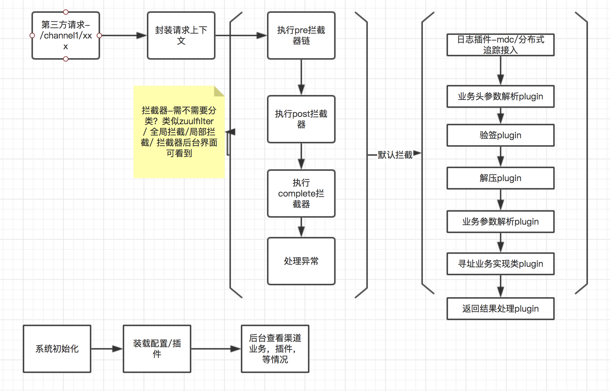

[旧文档](README_odl.md)
# 打算开始更新这个项目

首先调研需求

## 大体方向-- 对接第三方业务的平台框架

需求说明

* 平台 Frame 渠道方有 A，B，C，D
* 支持http的交互 包括a-->frame[渠道方的请求] , 和frame-->a(回调) [支持 亿级消息回调] 
* 支持 根据不同的渠道 做隔离 【类似zuul 中的服务隔离】
* 微内核+ 插件 --》看怎么实现
* 支持 各种插件的可替换 【实现一套默认的】
* 支持 后台界面配置 业务的功能
* 支持参数解析
* 支持签名，验签
* 思考如果在一个 日请求量上亿的 项目中使用，【包括 日志，监控，回调，隔离，降级】
* 如何支持内部，业务的 可插拔化 【涉及到 rpc，http】
* 支持每个渠道每个接口的参数 在后台可以配置 显示等

## 考虑怎么支持 亿级别的请求， 亿级别的回调？
1. 1亿 24小时--》算qps --》大概每秒 2000/s --> 每秒五千5000/s
2. 考虑配置 和 平台分离 【平台有本地缓存 -- 动态更新配置更新 平台缓存 ---》配置存储可以替换比如 db，redis】
3. 5000/s高并发--分5台机器也就--1000/s 一台支持1000s qps  【有可能qps集中在某个时间点 1w/qps】
4. 考虑渠道间的隔离 【】，不能一个渠道挂了，影响其他的渠道

## 功能
* 监控[业务/SLA]，统一上报
* 接口限流，渠道限流，渠道隔离降级
* 日志追踪
* 渠道接入全景图[基本信息配置/业务单元配置全景图]
* 验签和加签
* 解压和压缩
* 同一个请求缓存/ request cache
* 回调监控/超时监控/回调也要隔离  【专门做一个回调服务拆分 看量】
* 业务头解析
* 业务请求参数解析
* 业务返回参数解析
* 业务实现类寻址定位
* 各种异常配置/和管理-- 不同的渠道异常类型等都不一样 【自己的异常---渠道异常映射】
* 业务单元组合/逻辑单元组合实现-- 渠道业务
* 灰度功能
* 不同的渠道版本迭代相互不影响【如何实现】？后台上传jar包-- 热部署？【类似业务中台架构】
* 高性能 --  性能有问题的地方走本地缓存 【管理后台通过zk/http更新本地缓存】

## 思路说明
### 老思路
* 统一一个入口 --  走拦截器-- 解析请求参数-- 验签--- 定位业务处理类 --- 反射 -- 结果拦截器 -- 解析返回结果 -- 处理异常 

* 问题是：为什么一定要统一入口 ；

##### 渠道1
/channel1/pay/getpay
/channel1/pay/savepay
##### 渠道2
/channel2/payx/querypay
/channel2/payx/addpay

===
##### 问题
* 统一入口 -- 导致所有的请求都走这个入口--- 这个接口的qps 报表啊 【NIO 用的工作线程池处理的，和分开走差别不大吧【渠道隔离】】
* 渠道隔离 --- 肯定得做 --  每个渠道降级 【 需要能控制每个渠道的分配的量】
* 监控-- 数据上报  【业务监控和请求等监控】
* 参考 开源网关架构 -- 【配置和业务分离】 -- 需要运营后台能看到 全景的业务 配置
* 支持渠道上线新功能【灰度-- 一部分流量 header头中带tag？还是http v1/v2 第三方有关系】
* 支持 一个渠道上线 不需要所有的渠道都发版本 --【[每个渠道一个服务--shit【1000个渠道怎么搞，业务应该下沉到内部的服务】]【采用jar包更新热部署？】】
* 

###  不同意入口--直接在spring mvc层做-- 能不能行
*  url重写 映射  ---  还是不行 --好像无法处理 一个借口多业务实现

### 与开放平台的区别 --[是反过来的]
* 可能需要appid，验证签名
* 完善的配套测试后台--- 开放给对接人
* 还需要些sdk？【开始可能不需要，有文档就行】
* 可能还需要做url映射--- 其实就是反过来的东西
* 开放平台 -- 对每个appId ---  业务是确定的话那还是比较好
* 还有对api的管理，有些api可能是收费的/限制调用次数
* 还有防止黑客攻击什么的/刷api/ 访问控制/时效控制
* SLA

### 目前可扩展化原理

